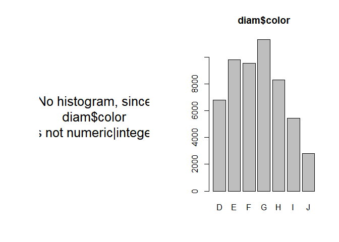
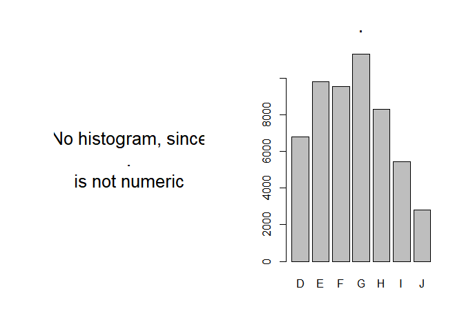

The tabs() function
================
Manuel Neumann

Quick and Dirty: THe tabs()-function
------------------------------------

Let's summarize the function as quick and dirty as the function summarizes a vector: Put a vector into the tabs() function and get all sorts of tables (with and without NAs & absolute/relative frequency distribution), as well as a quick and dirty histogram (for numeric | integer vectors) and a barplot.

Including Code
--------------

You can include R code in the document as follows:

``` r
library(magrittr)
source(file = "tabs-function.R")

diam <- ggplot2::diamonds

head(diam)
```

    ## # A tibble: 6 x 10
    ##   carat       cut color clarity depth table price     x     y     z
    ##   <dbl>     <ord> <ord>   <ord> <dbl> <dbl> <int> <dbl> <dbl> <dbl>
    ## 1  0.23     Ideal     E     SI2  61.5    55   326  3.95  3.98  2.43
    ## 2  0.21   Premium     E     SI1  59.8    61   326  3.89  3.84  2.31
    ## 3  0.23      Good     E     VS1  56.9    65   327  4.05  4.07  2.31
    ## 4  0.29   Premium     I     VS2  62.4    58   334  4.20  4.23  2.63
    ## 5  0.31      Good     J     SI2  63.3    58   335  4.34  4.35  2.75
    ## 6  0.24 Very Good     J    VVS2  62.8    57   336  3.94  3.96  2.48

``` r
head(mtcars)
```

    ##                    mpg cyl disp  hp drat    wt  qsec vs am gear carb
    ## Mazda RX4         21.0   6  160 110 3.90 2.620 16.46  0  1    4    4
    ## Mazda RX4 Wag     21.0   6  160 110 3.90 2.875 17.02  0  1    4    4
    ## Datsun 710        22.8   4  108  93 3.85 2.320 18.61  1  1    4    1
    ## Hornet 4 Drive    21.4   6  258 110 3.08 3.215 19.44  1  0    3    1
    ## Hornet Sportabout 18.7   8  360 175 3.15 3.440 17.02  0  0    3    2
    ## Valiant           18.1   6  225 105 2.76 3.460 20.22  1  0    3    1

``` r
# The function:
par(mfrow = c(1,2))

mtcars$cyl %>% tabs()
```



    ## $Summary
    ##    Min. 1st Qu.  Median    Mean 3rd Qu.    Max. 
    ##   4.000   4.000   6.000   6.188   8.000   8.000 
    ## 
    ## $Quantiles
    ##  2.5% 97.5% 
    ##     4     8 
    ## 
    ## $AbsDistNA
    ## variable
    ##    4    6    8 <NA>  Sum 
    ##   11    7   14    0   32 
    ## 
    ## $RelDistNA
    ## variable
    ##     4     6     8  <NA> 
    ## 34.38 21.88 43.75  0.00 
    ## 
    ## $AbsDist
    ## variable
    ##   4   6   8 Sum 
    ##  11   7  14  32 
    ## 
    ## $RelDist
    ## variable
    ##     4     6     8 
    ## 34.38 21.88 43.75

``` r
diam$color %>% tabs()
```



    ## $Summary
    ## [1] "No summary statistics, since . is not a numeric vector, but has class ordered"
    ## [2] "No summary statistics, since . is not a numeric vector, but has class factor" 
    ## 
    ## $Quantiles
    ## [1] "No quantiles, since . is not a numeric vector, but has class ordered"
    ## [2] "No quantiles, since . is not a numeric vector, but has class factor" 
    ## 
    ## $AbsDistNA
    ## variable
    ##     D     E     F     G     H     I     J  <NA>   Sum 
    ##  6775  9797  9542 11292  8304  5422  2808     0 53940 
    ## 
    ## $RelDistNA
    ## variable
    ##     D     E     F     G     H     I     J  <NA> 
    ## 12.56 18.16 17.69 20.93 15.39 10.05  5.21  0.00 
    ## 
    ## $AbsDist
    ## variable
    ##     D     E     F     G     H     I     J   Sum 
    ##  6775  9797  9542 11292  8304  5422  2808 53940 
    ## 
    ## $RelDist
    ## variable
    ##     D     E     F     G     H     I     J 
    ## 12.56 18.16 17.69 20.93 15.39 10.05  5.21

Including Plots
---------------
