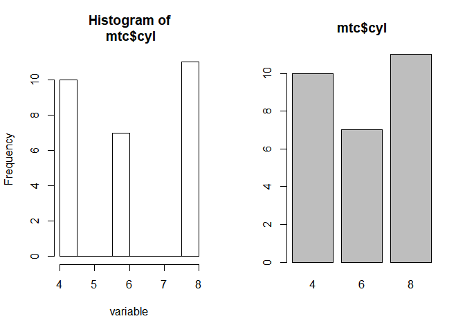
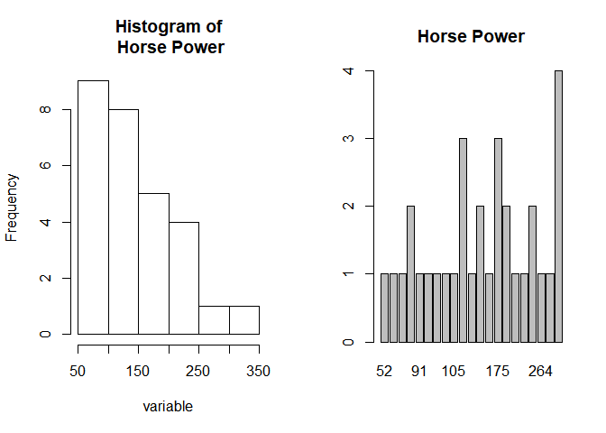

The tabs() function
================
Manuel Neumann (@powi\_manu)

Quick and Dirty: The tabs()-function
------------------------------------

Let's summarize the function as quick and dirty as the function summarizes a vector: Put a vector into the tabs() function and get all sorts of tables (with and without NAs & absolute/relative frequency distribution), as well as a quick and dirty histogram (for numeric | integer vectors) and a barplot.

Demonstration
-------------

Let's load the function:

``` r
library(magrittr) # Work with pipes
source(file = "tabs-function.R") # Load the function
```

Let's begin with the good old mtcars data:

``` r
mtc <- mtcars
head(mtc)
```

    ##                    mpg cyl disp  hp drat    wt  qsec vs am gear carb
    ## Mazda RX4         21.0   6  160 110 3.90 2.620 16.46  0  1    4    4
    ## Mazda RX4 Wag     21.0   6  160 110 3.90 2.875 17.02  0  1    4    4
    ## Datsun 710        22.8   4  108  93 3.85 2.320 18.61  1  1    4    1
    ## Hornet 4 Drive    21.4   6  258 110 3.08 3.215 19.44  1  0    3    1
    ## Hornet Sportabout 18.7   8  360 175 3.15 3.440 17.02  0  0    3    2
    ## Valiant           18.1   6  225 105 2.76 3.460 20.22  1  0    3    1

``` r
# Add randomly NAs
samNA <- sample(length(mtc[,1]), 4)
mtc$cyl[samNA] <- NA

# The function will return two plots. If you want to compar them, plotting them
# side by side may be nice:
par(mfrow = c(1,2))

# Choose a variable and run the tabs() function:
tabs(mtc$cyl)
```



    ## $Summary
    ##    Min. 1st Qu.  Median    Mean 3rd Qu.    Max.    NA's 
    ##   4.000   4.000   6.000   6.071   8.000   8.000       4 
    ## 
    ## $Quantiles
    ##  2.5% 97.5% 
    ##     4     8 
    ## 
    ## $AbsDistNA
    ## variable
    ##    4    6    8 <NA>  Sum 
    ##   10    7   11    4   32 
    ## 
    ## $RelDistNA
    ## variable
    ##     4     6     8  <NA> 
    ## 31.25 21.88 34.38 12.50 
    ## 
    ## $AbsDist
    ## variable
    ##   4   6   8 Sum 
    ##  10   7  11  28 
    ## 
    ## $RelDist
    ## variable
    ##     4     6     8 
    ## 35.71 25.00 39.29

Let's take a look at some non-numeric data:

``` r
# Load the diamonds data set
diam <- ggplot2::diamonds
head(diam)
```

    ## # A tibble: 6 x 10
    ##   carat       cut color clarity depth table price     x     y     z
    ##   <dbl>     <ord> <ord>   <ord> <dbl> <dbl> <int> <dbl> <dbl> <dbl>
    ## 1  0.23     Ideal     E     SI2  61.5    55   326  3.95  3.98  2.43
    ## 2  0.21   Premium     E     SI1  59.8    61   326  3.89  3.84  2.31
    ## 3  0.23      Good     E     VS1  56.9    65   327  4.05  4.07  2.31
    ## 4  0.29   Premium     I     VS2  62.4    58   334  4.20  4.23  2.63
    ## 5  0.31      Good     J     SI2  63.3    58   335  4.34  4.35  2.75
    ## 6  0.24 Very Good     J    VVS2  62.8    57   336  3.94  3.96  2.48

``` r
par(mfrow = c(1,2))

# And run the function
tabs(diam$color)
```


    ## $Summary
    ## [1] "No summary statistics, since diam$color is not a numeric|integer vector, but has class ordered"
    ## [2] "No summary statistics, since diam$color is not a numeric|integer vector, but has class factor" 
    ## 
    ## $Quantiles
    ## [1] "No quantiles, since diam$color is not a numeric|integer vector, but has class ordered"
    ## [2] "No quantiles, since diam$color is not a numeric|integer vector, but has class factor" 
    ## 
    ## $AbsDistNA
    ## variable
    ##     D     E     F     G     H     I     J  <NA>   Sum 
    ##  6775  9797  9542 11292  8304  5422  2808     0 53940 
    ## 
    ## $RelDistNA
    ## variable
    ##     D     E     F     G     H     I     J  <NA> 
    ## 12.56 18.16 17.69 20.93 15.39 10.05  5.21  0.00 
    ## 
    ## $AbsDist
    ## variable
    ##     D     E     F     G     H     I     J   Sum 
    ##  6775  9797  9542 11292  8304  5422  2808 53940 
    ## 
    ## $RelDist
    ## variable
    ##     D     E     F     G     H     I     J 
    ## 12.56 18.16 17.69 20.93 15.39 10.05  5.21

Specifications
--------------

You can easily specify some of the options. The defaults look like this:

-   quantiles: a vector with the lower and upper bound of the quantile (default: c(0.025, 0.975))
-   rd: round the decimals (default: 2)
-   barNA: include the NAs in the barplot (default: FALSE)
-   name: give the variable a name (e.g. for the plots; default: the vector name)

``` r
# Example

# Add randomly NAs
mtc$hp[samNA] <- NA

par(mfrow = c(1,2))

# The function with additions:
tabs(mtc$hp, quantiles = c(0.2, 0.8), rd = 1, barNA = TRUE, name = "Horse Power")
```



    ## $Summary
    ##    Min. 1st Qu.  Median    Mean 3rd Qu.    Max.    NA's 
    ##    52.0    94.5   118.0   143.8   180.0   335.0       4 
    ## 
    ## $Quantiles
    ##   20%   80% 
    ##  91.8 195.0 
    ## 
    ## $AbsDistNA
    ## variable
    ##   52   62   65   66   91   93   95   97  105  110  113  123  150  175  180 
    ##    1    1    1    2    1    1    1    1    1    3    1    2    1    3    2 
    ##  205  215  245  264  335 <NA>  Sum 
    ##    1    1    2    1    1    4   32 
    ## 
    ## $RelDistNA
    ## variable
    ##   52   62   65   66   91   93   95   97  105  110  113  123  150  175  180 
    ##  3.1  3.1  3.1  6.2  3.1  3.1  3.1  3.1  3.1  9.4  3.1  6.2  3.1  9.4  6.2 
    ##  205  215  245  264  335 <NA> 
    ##  3.1  3.1  6.2  3.1  3.1 12.5 
    ## 
    ## $AbsDist
    ## variable
    ##  52  62  65  66  91  93  95  97 105 110 113 123 150 175 180 205 215 245 
    ##   1   1   1   2   1   1   1   1   1   3   1   2   1   3   2   1   1   2 
    ## 264 335 Sum 
    ##   1   1  28 
    ## 
    ## $RelDist
    ## variable
    ##   52   62   65   66   91   93   95   97  105  110  113  123  150  175  180 
    ##  3.6  3.6  3.6  7.1  3.6  3.6  3.6  3.6  3.6 10.7  3.6  7.1  3.6 10.7  7.1 
    ##  205  215  245  264  335 
    ##  3.6  3.6  7.1  3.6  3.6
